## 机票 Skill 设计方案

> **核心愿景**：**PRD → 设计稿 → 审查 → Figma** 全自动化流水线。你只在关键节点逐模块拍板。

---

### 项目位置与职责边界

本文件是**飞猪机票执行层主锚**：设计生成、审查、Figma 交付的真相源。上游由 **需求看板**（`online-index.html`，H5）负责产出 PRD 拆解 Markdown，中游为 `flight-prd-to-design` 编排与路由，下游为 Figma 精调。上中下游的细节不在此重复，仅以衔接小节与字段映射的方式保持一致。

### 端到端视图

```mermaid
flowchart LR
  kanban[KanbanTrigger] --> h5Decompose[需求看板 PRD 拆解]
  h5Decompose --> prdMd[PrdDecomposeMarkdown]
  prdMd --> prdGate[gstackAwesomeReviewGate]
  prdGate --> routeStep[flightRouting]
  routeStep --> benchmark[googleAwesomeBenchmark]
  benchmark --> designGen[fliggyFlightDesignExec]
  designGen --> review[ceoAndDesignReview]
  review --> handoff[figmaHandoffPackage]
```



---

### 工作流

```
┌──────────────────────────────────────────────────────────────────────────┐
│                         设计自动化流水线                                   │
│                                                                          │
│  Phase 1          Phase 1.2                Phase 1.5      Phase 2       Phase 3     Phase 4 │
│  PRD拆解MD接入  →  gstack+awesome 审查闸门  →  外部基线对标  →  设计稿生成  →  自动审查  →  推送 Figma │
│  需求看板（H5）       gstack+awesome review      benchmark      design skill     review      handoff │
│                       │                                                  │
│                       │ 你拍板                                           │
│                       ▼                                                  │
│                  ┌──────────┐                                            │
│                  │ 通过？    │── 通过 ──→ 进入下一阶段                    │
│                  └──────────┘                                            │
│                       │ 不通过                                           │
│                       ▼                                                  │
│           ┌──────────┐    ┌──────────┐    ┌──────────┐                  │
│           │ 参考 awesome │ → │ 展示参考  │ →  │ 重新生成  │                  │
│           │web_search优先│   │ 询问方向  │    │ 记录经验  │                  │
│           └──────────┘    └──────────┘    └──────────┘                  │
│                                                 │ 仍不通过               │
│                                                 └───→ 循环              │
│                                                                          │
│  ┌──────────────────────────────────────────────────────────────────┐    │
│  │ 持续学习：失败经验自动记录 → 同类 >=3 次自动提炼规律 → 生成前回顾  │    │
│  └──────────────────────────────────────────────────────────────────┘    │
└──────────────────────────────────────────────────────────────────────────┘
```

---

### 阶段详解

#### Phase 0：需求接入与触发（衔接上游）

本阶段不在机票执行层展开，只做接入说明：

- 入口：在 **需求看板**（`online-index.html`）完成 PRD 拆解，核心产物是 **PRD 拆解 Markdown 文档**
- 触发本工作流的前置条件：上游 `ai_design.status = completed` 且 PRD 拆解 MD 已生成
- 本工作流从“拿到 PRD 拆解 MD”开始，不再重复走原始 PRD 的拆解流程
- 上游详情不重复写，见 `docs/ai-design-assistant-workflow.md` 与 **需求看板**（`online-index.html`）

#### Phase 1：PRD 拆解 MD 接入与结构化

读取上游 H5 产出的 PRD 拆解 Markdown → 解析模块清单（模块名 + 需求 + 页面 + 意图类型 + 备注）→ 对齐为执行层结构化字段 → **暂停等你确认**。

**上游字段映射（以 PRD 拆解 MD 为主）**：

| 上游（PRD 拆解 MD / `ai_design.modules[]`） | 本阶段（`prd-recognition` 模块） |
|---|---|
| `name` | `name` |
| `page` | `page` |
| `intent` | `intent` |
| `change_type` | `change_type` |
| `notes` | `notes` |

本阶段必须补齐路由所需字段：`page_id`、`baseline_artifact`、`module_slug`（拆解契约见 `skills/prd-recognition/SKILL.md`）。若 MD 缺少这些字段，需在本阶段补齐后才可进入后续流程。

#### Phase 1.2：gstack 需求审查闸门（先审后生）

PRD 拆解 MD 结构化完成后，必须先执行一次 gstack review，再进入设计生成链路：

**awesome-design 审查机制（方法层）**：在结构审查之外，强制按 `https://github.com/gztchan/awesome-design` 分类执行四维检查：

- `styleguide_branding`：信息与品牌表达是否一致，关键模块命名与语义是否清晰
- `color_typography`：信息层级、可读性与文本组织是否满足后续设计落地
- `usability_review`：关键任务路径是否完整，是否存在阻断交互或缺失场景
- `user_testing`：是否定义最小可验证用例与验收口径，确保后续评审可复现

1. 对 Phase 1 输出做结构审查（模块边界、页面归属、意图类型、冲突项）
2. 执行 awesome-design 四维审查并标注阻断项（blocking）与建议项（advisory）
3. 审查通过条件：结构审查通过 + 四维审查无 blocking
4. 审查阻断条件：任一维度出现 blocking，立即回退 Phase 1 修正 MD，再进入 Phase 1.2 重审
5. 审查输出契约：必须产出“审查结论摘要 + blocking 清单 + 修正建议”，并可映射到后续 `benchmark_source` / `benchmark_dimensions` / `benchmark_notes`

这一步的目标是先把需求结构校准，再调用设计 skill 生成，降低后续返工。

#### Phase 1.5：外部设计基线对标（awesome-design）

对每个页面/模块做“方法层”对标，不直接复制样式：

1. 参考源固定：`https://github.com/gztchan/awesome-design`
2. 至少映射三类维度：
   - `styleguide_branding`（风格一致性、品牌表达）
   - `color_typography`（色彩与文字层级）
   - `usability_review`（可用性与验证点）
3. 生成对标追溯字段（供后续阶段继承）：
   - `benchmark_source`：`gztchan/awesome-design`
   - `benchmark_dimensions`：维度数组
   - `benchmark_notes`：应用点、取舍点、冲突处理
4. 若与机票基线冲突：优先保留飞猪页面信息架构与业务路径，不做结构性破坏。

#### Phase 2：设计稿生成

**前置条件**：仅当 Phase 1.2 的 gstack + awesome-design 审查通过，才允许进入本阶段。

**规则基线（强制）**：进入生成前必须先遵循 `skills/fliggy-flight-design-skill/playbooks/flight-funnel/0 Fliggy Design Skill/SKILL.md` 的读取与输出规范：

1. 先读 `0 Fliggy Design Skill/SKILL.md`（唯一入口）
2. 按需求选择组件后，仅读取对应组件 `README.md`（禁止全量读组件）
3. `example.html` 仅在结构不明确时读取
4. 输出检查必须通过：
   - 单文件 HTML + 内联 CSS
   - `<meta name="viewport" content="width=750, user-scalable=no">`
   - 颜色/圆角通过 `:root` token + `var(...)` 引用，禁止无依据硬编码
   - 图片按规则使用真实图资源（默认 Unsplash 规范；若采用飞猪线上素材，需在结果中记录取舍）

**中游路由衔接**：进入生成前必须先过一次 `skills/flight-prd-to-design/routing.md` 的路由算法，路由产出的以下字段必须带入生成上下文：

- `route_key`（home / booking / list / ota / unknown）
- `route_status`（supported / partial / unsupported）
- `execution_mode`（normal / fallback-insert / human-confirmation）
- `resolved_baseline_artifact`
- `fallback_reason`（降级时必填，不可为空）

`unsupported` 场景禁止进入本阶段，必须回到 Phase 0/1 做人工确认。

逐模块执行：

1. 读 `design-foundations.md` → token 体系
2. 读**行业组件库**（按需）→ 框架组件 / 输出组件
3. 读 `example-full.html` → 页面真相源
4. 读 `spec.md` → 配置项和变体
5. 回顾 `.learnings/DESIGN_LEARNINGS.md` → 规避已知问题
6. 如需真实数据 → 调 `flyai search-flight`
7. 融合 `benchmark_*` 字段指导生成（尤其是信息层级和可用性提示）
8. 生成单文件 HTML → **暂停等你确认**

**行业组件库**：

| 类型 | 物料路径 | 包含 |
|------|---------|------|
| **框架组件** | `Fliggy Design Skill/框架组件.md` | 导航栏、底部输入区、输入气泡、点赞与分享、追问 |
| **输出组件** | `Fliggy Design Skill/输出组件/` | 交通卡、商品卡、下单卡、订单卡、酒店房型卡、选择器、按钮、表格、文本、图片 |

**不通过时**：先用 `web_search` 仔细参考 `gztchan/awesome-design`（优先看 styleguide/branding、color/typography、usability review）→ 再补充同类竞品参考 → 展示参考询问方向 → 重新生成 → 记录失败经验到 `.learnings/` → 仍不通过则循环。

#### Phase 3：设计审查

1. gstack browse 截图验证
2. CEO Review（架构/错误路径/数据UX/设计）
3. Design Review（10 维度评分 A-F + AI Slop 检测）
4. 检查对标追溯完整性（`benchmark_source`/`benchmark_dimensions`/`benchmark_notes`）
5. 可自动修复的直接修复 → 输出审查报告 → **暂停等你拍板**

**审查同步规则**：审查结论必须与 `figma_handoff.review_summary` 保持一致；`key_issues > 0` 时 `figma_handoff.status` 禁止置为 `ready`；对标字段缺失同样禁止 `ready`（详见 `skills/flight-prd-to-design/figma-handoff-standard.md`）。

#### Phase 4：推送到 Figma

gstack browse 全页截图存档 → 通过 HTML to Figma 插件导入 Figma → 展示交付清单（含对标说明）→ 你在 Figma 中精调。

**交付契约引用**：交付包结构以 `skills/flight-prd-to-design/figma-handoff-standard.md` 为准，必须包含 `benchmark_source` / `benchmark_dimensions` / `benchmark_notes`，以及与审查结果对齐的 `review_summary` 和 `status`。

---

### 交互协议

| 阶段 | 你的操作 | 不通过时 AI 的行动 |
|------|---------|-------------------|
| Phase 1 | 同意 / 修改 / 跳过 | 按修改意见调整计划 |
| Phase 1.2 | 接受审查结论 / 要求重审 | 按 awesome-design blocking 项优先修正，回退 Phase 1 后重审 |
| Phase 1.5 | 接受对标 / 调整维度 | 重做映射并记录取舍 |
| Phase 2 | 通过 / 调整 / 重做 | 先按 `0 Fliggy Design Skill` 规则修正（读取顺序/token/图片）→ 再参考 `gztchan/awesome-design` 重新生成 |
| Phase 3 | 接受修复 / 换方案 / 忽略 | 按决策执行 |
| Phase 4 | 选择模块导入 Figma | 输出 HTML 代码供粘贴 |

---

### 持续学习

| 时机 | 行为 |
|------|------|
| **生成前** | grep `.learnings/` 中同类历史记录，主动规避 |
| **失败后** | 记录模块名、反馈原文、失败原因、参考方向、修复方案、设计规律总结 |
| **同类 >= 3 次** | 自动提炼规律，晋升到 `spec.md` / `SKILL.md` / `patterns/` |

---

### 设计决策

**独立机票 Skill，继承 FDG 核心**。理由：机票 spec 深度 10x 于 FDG 通用模板；业务有大量特有逻辑（航班动态/座位图/退改签/舱等）；需要编排完整流水线而非单步生成。

---

### 关键原则

1. **Example-First**：`example.html` 为真相源，`spec.md` 为辅助
2. **配置驱动**：AI 改配置值，不需理解整个 DOM
3. **真实数据**：flyai 实时数据，不自建静态库
4. **双轨输出**：App 页面（750px @2x）+ AI 对话卡片（自适应宽度）
5. **方法对标**：融合 awesome-design 的方法维度，不照搬外部视觉结果
6. **可追溯交付**：每次输出必须包含 `benchmark_*` 字段，保证复盘可审计

---

### 目录结构

```
fliggy-flight-skill/
├── SKILL.md                    ← 流水线编排入口
├── foundations/                 ← token 体系 + 配图 + 机票扩展 token
├── pages/                      ← 页面物料（home/booking/list/ota）
│   └── {page}/modules/         ← 各模块 spec.md + example
├── components/                 ← 机票特有组件（航线/航班卡/座位图/低价日历等）
├── patterns/                   ← 设计模式（搜索表单/价格展示/时间轴/筛选）
├── data/                       ← 机场/舱等/示例航班快照
├── ai-cards/                   ← AI 对话卡片（交通卡/下单卡/订单卡）
└── .learnings/                 ← 失败经验记录
```

---

### 落地路径

| 阶段 | 周期 | 内容 |
|------|------|------|
| Phase 0 | 现在 | 整合已有物料（首页 spec + 下单页 HTML + AI 卡片） |
| Phase 1 | 1 周 | 写 SKILL.md 编排入口（P/A/B/C/D 五类意图 + 业务知识） |
| Phase 2 | 2 周 | 补齐列表页 + OTA 页，覆盖机票全链路 |
| Phase 3 | 持续 | 组件/模式/审查规则持续优化 |

---

### 字段与状态对齐表

为保证上中下游可审计，以下字段与状态必须在各阶段之间保持一致（单一真相源在此）：

| 维度 | 状态值 | 所在层 | 跃迁触发点 |
|---|---|---|---|
| `ai_design.status` | `idle` → `queued` → `processing` → `needs_confirmation` → `completed` | 上游（看板 + AI 助理/H5） | `completed` 且 PRD 拆解 MD 可用后才进入 Phase 1 |
| `prd_decompose_md` | `ready`（非空且可解析） | 上游（**需求看板**，`online-index.html`） | 作为 Phase 1 唯一正式输入；缺失则不启动后续阶段 |
| `Phase 1.2` 阶段约束 | `must_pass`（结构审查 + awesome-design 四维无 blocking） | 阶段闸门（非状态机字段） | 未通过前禁止进入 Phase 2 |
| `route_status` | `supported` / `partial` / `unsupported` | 中游（`flight-prd-to-design`） | Phase 2 进入前产出，`unsupported` 回退 Phase 0/1 |
| `execution_mode` | `normal` / `fallback-insert` / `human-confirmation` | 中游 | Phase 2 生成时必须按此模式执行 |
| `phase2_rule_check` | `pass`（满足 `0 Fliggy Design Skill` 生成规则） | 执行约束（非状态机字段） | 未通过则禁止交付，回退 Phase 2 重生成 |
| `figma_handoff.status` | `draft` → `reviewed` → `ready` → `imported` → `refined` | 下游（交付） | `draft` 在 Phase 2，`reviewed` 在 Phase 3，`ready` 在 Phase 3 收尾，`imported/refined` 在 Phase 4 |
| `benchmark_source` / `benchmark_dimensions` / `benchmark_notes` | 非空 | 贯穿 Phase 1.5 → Phase 4 | 任一缺失禁止 `figma_handoff.status = ready` |

### 相关文档

| 文档 | 定位 |
|---|---|
| [`docs/ai-design-assistant-workflow.md`](../../docs/ai-design-assistant-workflow.md) | 上游：看板触发与 AI 助理三阶段拆解 |
| [`docs/flight-prd-to-figma-workflow.md`](../../docs/flight-prd-to-figma-workflow.md) | 中游：机票 PRD → Figma 的 V1 全流程 |
| [`skills/prd-recognition/SKILL.md`](../prd-recognition/SKILL.md) | 拆解契约：模块字段与三连技规则 |
| [`skills/flight-prd-to-design/SKILL.md`](../flight-prd-to-design/SKILL.md) | 编排层：总入口与输出协议 |
| [`skills/flight-prd-to-design/routing.md`](../flight-prd-to-design/routing.md) | 路由规则：页面支持度与降级策略 |
| [`skills/flight-prd-to-design/figma-handoff-standard.md`](../flight-prd-to-design/figma-handoff-standard.md) | 交付契约：Figma 交付包字段与状态机 |
| [`skills/flight-prd-to-design/google-awesome-design-baseline.md`](../flight-prd-to-design/google-awesome-design-baseline.md) | 对标基线：awesome-design 方法维度与追溯字段 |
| [`skills/fliggy-flight-design-skill/playbooks/flight-funnel/0 Fliggy Design Skill/SKILL.md`](playbooks/flight-funnel/0 Fliggy Design Skill/SKILL.md) | 生成规则基线：读取顺序、token、图片与输出约束 |
